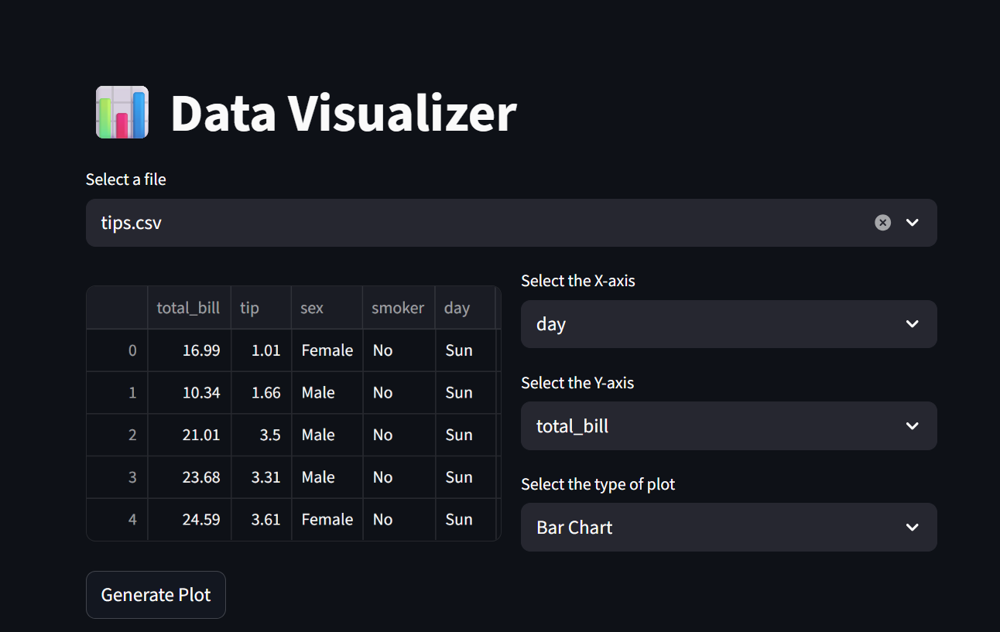
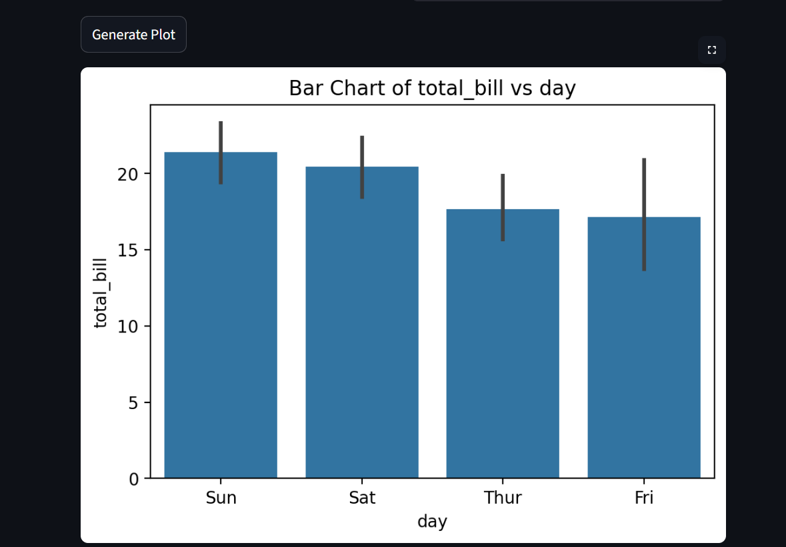

# 📊 Data Visualizer - Streamlit Web Application

## 🖼️ Application Preview

### Home Page

*Clean interface for dataset selection*

### Visualization in Action  

*Interactive chart generation with user-selected parameters*

## 📖 Table of Contents
- [Introduction](#introduction)
- [What is This Project?](#what-is-this-project)
- [Why I Built This Project](#why-i-built-this-project)
- [Features](#features)
- [Technologies Used](#technologies-used)
- [Installation Guide](#installation-guide)
- [How to Use](#how-to-use)
- [Project Structure](#project-structure)
- [Code Explanation](#code-explanation)
- [Sample Datasets](#sample-datasets)
- [Future Enhancements](#future-enhancements)
- [Learning Outcomes](#learning-outcomes)
- [Contributing](#contributing)
- [License](#license)

## 🌟 Introduction

Welcome to the **Data Visualizer** - an interactive web application built with Python and Streamlit that allows users to upload CSV files and create beautiful, interactive visualizations with just a few clicks! This project is designed to make data analysis accessible to everyone, regardless of their programming background.

## 🤔 What is This Project?

### The Problem
In today's data-driven world, understanding data is crucial. However, many people struggle with:
- **Technical barriers**: Learning programming languages like Python/R for data visualization
- **Software costs**: Expensive tools like Tableau or specialized software
- **Complexity**: Overwhelming interfaces of professional data analysis tools
- **Time consumption**: Setting up environments and writing code for simple visualizations

### The Solution
The Data Visualizer provides:
- **No-code solution**: Visual interface without writing any code
- **Free and open-source**: Completely free to use and modify
- **Web-based**: Accessible from any browser, no installation needed
- **User-friendly**: Simple, intuitive interface designed for beginners
- **Instant results**: Generate visualizations in seconds

## 🎯 Why I Built This Project

### Personal Motivation
As a student/developer learning data science, I wanted to:
1. **Learn by building**: Understand how data visualization tools work under the hood
2. **Create something useful**: Build a tool that could help others in their data analysis journey
3. **Practice full-stack development**: Work with frontend (Streamlit UI) and backend (Python data processing)
4. **Showcase skills**: Demonstrate my ability to create practical applications

### Educational Value
This project serves as:
- **Learning platform**: For understanding data visualization principles
- **Portfolio project**: Demonstrating practical programming skills
- **Teaching tool**: Helping others understand data analysis concepts
- **Foundation**: For more advanced data science projects

## ✨ Features

### 📁 Data Management
- **Multiple Dataset Support**: Work with various CSV files simultaneously
- **Automatic Detection**: Automatically finds all CSV files in the data folder
- **Data Preview**: Quick view of your dataset before visualization
- **Column Recognition**: Automatically identifies numeric and categorical columns

### 📊 Visualization Types
1. **Line Plots**: Perfect for time series data and trends
2. **Bar Charts**: Ideal for categorical comparisons
3. **Scatter Plots**: Great for correlation analysis
4. **Distribution Plots**: Understand data spread and outliers
5. **Count Plots**: Visualize frequency of categorical data

### 🎨 User Experience
- **Interactive Interface**: Real-time updates and instant visualization
- **Responsive Design**: Works on different screen sizes
- **Intuitive Controls**: Simple dropdowns and buttons
- **Professional Styling**: Clean, modern interface

## 🛠 Technologies Used

### Programming Languages
- **Python 3.13**: Main programming language
  - *Why Python?*: Excellent for data analysis, vast library ecosystem, beginner-friendly

### Core Libraries
- **Streamlit 1.50.0**: Web application framework
  - *Why Streamlit?*: Turns data scripts into shareable web apps quickly, no HTML/CSS/JavaScript needed
- **Pandas 2.3.3**: Data manipulation and analysis
  - *Why Pandas?*: Industry standard for data manipulation, handles CSV files efficiently
- **NumPy 2.3.3**: Numerical computing
  - *Why NumPy?*: Foundation for numerical operations in Python, used by other data science libraries

### Visualization Libraries
- **Matplotlib 3.10.6**: Comprehensive plotting library
  - *Why Matplotlib?*: Most widely used Python plotting library, highly customizable
- **Seaborn 0.13.2**: Statistical data visualization
  - *Why Seaborn?*: Built on Matplotlib, provides beautiful default styles and complex visualizations

### Additional Dependencies
- **Altair**: Declarative statistical visualization
- **Pillow**: Image processing capabilities
- **PyArrow**: Efficient data handling
- **Watchdog**: File system monitoring

## 💻 Installation Guide

### Prerequisites
- Python 3.8 or higher
- pip (Python package installer)
- Web browser (Chrome, Firefox, Safari, or Edge)

### Step-by-Step Installation

#### 1. Clone the Repository
```bash
# Copy this project to your computer
git clone https://github.com/Md-Arshad1201/Data_Visualizer.git
cd Data_Visualizer
```

#### 2. Create Virtual Environment (Recommended)
```bash
# Create isolated Python environment
python -m venv venv

# Activate on Windows:
venv\Scripts\activate

# Activate on Mac/Linux:
source venv/bin/activate
```

#### 3. Install Dependencies
```bash
# Install all required libraries
pip install -r requirements.txt
```

#### 4. Run the Application
```bash
# Start the web application
streamlit run main.py
```

#### 5. Access the Application
- Open your web browser
- Go to: `http://localhost:8501`
- The application will load automatically!

## 🚀 How to Use

### Step 1: Prepare Your Data
1. Place your CSV files in the `data` folder
2. Ensure your data is properly formatted
3. Supported: CSV files with headers

### Step 2: Launch the Application
1. Run `streamlit run main.py`
2. Wait for the browser to open automatically

### Step 3: Select Your Dataset
1. Use the dropdown to select your CSV file
2. View data preview in the left panel
3. Check basic information about your dataset

### Step 4: Create Visualizations
1. **Choose X-axis**: Select the column for horizontal axis
2. **Choose Y-axis**: Select the column for vertical axis
3. **Select Plot Type**: Choose from 5 visualization types
4. **Generate Plot**: Click the button to create your visualization

### Step 5: Interpret Results
- Analyze patterns and trends in your data
- Export images if needed (right-click on plot)
- Try different plot types for various insights

## 📁 Project Structure

```
Data_Visualizer/
│
├── data/                   # Sample datasets for testing
│   ├── diabetes.csv       # Medical data for diabetes analysis
│   ├── heart.csv          # Cardiovascular disease data
│   ├── parkinsons.csv     # Parkinson's disease measurements
│   ├── tips.csv           # Restaurant tipping behavior
│   └── titanic.csv        # Titanic passenger survival data
│
├── main.py                # Main application file
├── requirements.txt       # Python dependencies
├── .gitignore            # Files to ignore in version control
└── README.md             # This documentation file
```

## 🔍 Code Explanation

### Main Application Flow

```python
# 1. Import Libraries
import streamlit as st
import pandas as pd
import matplotlib.pyplot as plt
import seaborn as sns
import os

# 2. Page Configuration
st.set_page_config(
    page_title='Data Visualizer',
    layout='centered', 
    page_icon='📊'
)
# Why: Sets up the web page appearance and title

# 3. File Detection
working_dir = os.path.dirname(os.path.abspath(__file__))
folder_path = f"{working_dir}/data"
files = [f for f in os.listdir(folder_path) if f.endswith('.csv')]
# Why: Automatically finds all CSV files in the data folder

# 4. User Interface
selected_file = st.selectbox('Select a file', files, index=None)
# Why: Lets users choose which dataset to analyze

# 5. Data Loading and Processing
if selected_file:
    file_path = os.path.join(folder_path, selected_file)
    df = pd.read_csv(file_path)
    # Why: Loads the selected CSV file into a pandas DataFrame
    
# 6. Visualization Logic
if plot_type == 'Line Plot':
    sns.lineplot(x=df[x_axis], y=df[y_axis], ax=ax)
elif plot_type == 'Bar Chart':
    sns.barplot(x=df[x_axis], y=df[y_axis], ax=ax)
# Why: Different plot types for different data analysis needs
```

### Key Functions Explained

1. **Data Loading**: `pd.read_csv()` efficiently reads CSV files into structured data
2. **Plot Generation**: Seaborn and Matplotlib create publication-quality visualizations
3. **User Interface**: Streamlit widgets (selectbox, buttons) provide interactive controls
4. **Layout Management**: Streamlit columns organize the interface logically

## 📊 Sample Datasets

### Included for Demonstration:

1. **Titanic Dataset**
   - **What**: Passenger information from RMS Titanic
   - **Use Case**: Survival analysis, demographic studies
   - **Columns**: Age, Sex, Class, Survived, etc.

2. **Tips Dataset** 
   - **What**: Restaurant tipping behavior
   - **Use Case**: Service industry analysis, customer behavior
   - **Columns**: Total bill, Tip, Gender, Day, Time, etc.

3. **Diabetes Dataset**
   - **What**: Medical data for diabetes analysis
   - **Use Case**: Healthcare analytics, medical research
   - **Columns**: Glucose, BMI, Age, Outcome, etc.

4. **Heart Disease Dataset**
   - **What**: Cardiovascular patient data
   - **Use Case**: Medical research, risk factor analysis
   - **Columns**: Age, Cholesterol, Blood Pressure, etc.

5. **Parkinson's Dataset**
   - **What**: Voice measurements for Parkinson's patients
   - **Use Case**: Medical diagnostics, pattern recognition
   - **Columns**: Various voice measurement parameters

## 🔮 Future Enhancements

### Planned Features
- [ ] **More Chart Types**: Box plots, heatmaps, pie charts
- [ ] **Data Preprocessing**: Handle missing values, data cleaning
- [ ] **Statistical Analysis**: Correlation matrix, hypothesis testing
- [ ] **Export Options**: Download charts as PNG/PDF
- [ ] **Themes**: Dark mode and custom color schemes
- [ ] **User Authentication**: Save user preferences and history
- [ ] **Real-time Data**: Connect to live data sources
- [ ] **Machine Learning**: Basic predictive modeling integration

### Technical Improvements
- [ ] **Performance Optimization**: Faster loading for large datasets
- [ ] **Error Handling**: Better user feedback for invalid operations
- [ ] **Mobile Responsiveness**: Improved experience on mobile devices
- [ ] **Accessibility**: Screen reader support and keyboard navigation

## 📚 Learning Outcomes

### Technical Skills Gained
1. **Python Programming**: Advanced data manipulation and visualization
2. **Web Development**: Building interactive web applications
3. **Data Science**: Practical experience with real datasets
4. **Version Control**: Professional Git and GitHub workflow
5. **Deployment**: Application deployment and distribution

### Soft Skills Developed
1. **Problem Solving**: Debugging and troubleshooting complex issues
2. **Project Management**: Planning and executing a complete project
3. **Documentation**: Creating comprehensive user guides
4. **User Experience Design**: Designing intuitive interfaces

## 🤝 Contributing

### How You Can Help
I welcome contributions from the community! Here's how you can help improve this project:

1. **Report Bugs**: Found an issue? Create a detailed bug report
2. **Suggest Features**: Have ideas for new features? Share them!
3. **Code Contributions**: Submit pull requests with improvements
4. **Documentation**: Help improve this README or add tutorials
5. **Testing**: Test the application and provide feedback

### Contribution Guidelines
1. Fork the repository
2. Create a feature branch (`git checkout -b feature/AmazingFeature`)
3. Commit your changes (`git commit -m 'Add some AmazingFeature'`)
4. Push to the branch (`git push origin feature/AmazingFeature`)
5. Open a Pull Request

## 📄 License

This project is licensed under the MIT License - see the [LICENSE](LICENSE) file for details.

### What This Means:
- ✅ **You can use** this code for personal projects
- ✅ **You can modify** and adapt the code
- ✅ **You can distribute** the software
- ✅ **You can use** commercially
- ❌ **No warranty** provided
- ❌ **Not liable** for damages

## 🌟 Final Thoughts

### Why This Project Matters
This Data Visualizer represents more than just code - it's a testament to the power of making data analysis accessible to everyone. In a world increasingly driven by data, tools like this help bridge the gap between complex data science and practical, everyday understanding.

### Message to My Future Self
If you're reading this years later, remember:
- This was one of your first complete web applications
- You built this to solve a real problem and help others
- The journey of learning never stops - keep building!
- Be proud of what you accomplished here

### Get In Touch
- **GitHub**: [Md-Arshad1201](https://github.com/Md-Arshad1201)
- **Project Link**: [https://github.com/Md-Arshad1201/Data_Visualizer](https://github.com/Md-Arshad1201/Data_Visualizer)

---

**⭐ If you found this project helpful, please give it a star on GitHub!**

*"Data is the new oil, but visualization is the refinery that makes it useful."* - Unknown

---

*Last Updated: October 2025*  
*Built with ❤️ using Python and Streamlit*# Data_Visualizer
